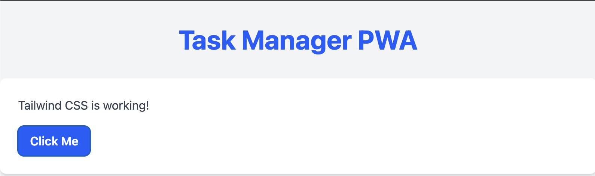
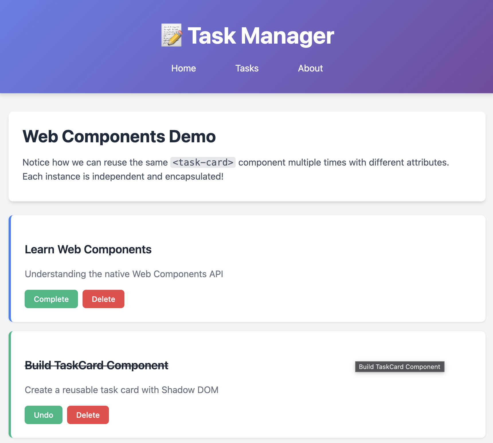

# Modern Web Development Tutorial
## Building a Task Manager PWA with Vite + TypeScript

This tutorial will teach you these technologies by building a real application:
- ✅ Vite (Dev server + build)
- ✅ ESLint + Prettier (Code quality)
- ✅ Tailwind CSS (Styling)
- ✅ Navigo (Client routing)
- ✅ Fetch API (HTTP requests)
- ✅ Vitest + Testing Library (Testing)
- ✅ Web Components (UI components)
- ✅ Workbox (PWA support)

## Tutorial Roadmap

```
Phase 0: Project Setup
└── Step 0: Create Vite project with TypeScript

Phase 1: Setup & Configuration
├── Step 1: ESLint + Prettier
└── Step 2: Tailwind CSS

Phase 2: Core Features
├── Step 3: Web Components (TaskCard, AppHeader)
├── Step 4: Navigo Routing + State Management
└── Step 5: Fetch API Integration

Phase 3: Quality & PWA
├── Step 6: Vitest + Testing Library
└── Step 7: Workbox PWA Support
```

**Estimated time:** 2-3 hours
**Prerequisites:** Basic JavaScript/TypeScript knowledge
**What you'll build:** A fully functional, offline-capable task manager

---

## Phase 0: Project Setup

### Step 0: Create Vite Project

**What you'll learn:** Scaffolding a modern Vite + TypeScript project from scratch.

**Create Vite project:**
```bash
npm create vite@latest webapp
```

When prompted, choose:
- **Select a framework:** → `Vanilla`
- **Select a variant:** → `TypeScript`
- **Use rolldown-vite (Experimental)?** → `Yes` (faster Rust-based bundler) or `No` (standard Vite)
- **Install with npm and start now?** → `Yes`

This will:
- Create `package.json`, `tsconfig.json`, `index.html`
- Create `src/` and `public/` directories with demo files
- Install dependencies
- Configure Vite for TypeScript

> **Note on rolldown-vite:**
>
> Rolldown is an experimental Rust-based bundler that's significantly faster than the standard Vite build. It's compatible but may have occasional edge cases. Choose `Yes` for speed, `No` for stability.


**Verify the setup works:**
Visit http://localhost:5173 - you should see the Vite welcome page.
Alternatively run
```bash
npm run dev
```

**Clean up demo files:**
```bash
# Remove demo files - we'll create our own
rm src/counter.ts
rm src/typescript.svg
```


**Your project structure should now look like:**
```
webapp/
├── node_modules/
├── public/
│   └── vite.svg         # Logo
├── src/
│   ├── main.ts          # Entry point
│   └── style.css        # Global styles
├── index.html           # HTML template
├── package.json         # Dependencies & scripts
└── tsconfig.json        # TypeScript config
```

---

## Phase 1: Setup & Configuration

### Step 1: ESLint + Prettier Setup

**What you'll learn:** Code quality tools that automatically catch errors and format your code consistently.

**Generate ESLint configuration:**
```bash
npm init @eslint/config@latest
```

When prompted, choose:
- **What do you want to lint?** → `javascript`
- **How would you like to use ESLint?** → `problems`
- **What type of modules does your project use?** → `esm`
- **Which framework does your project use?** → `none`
- **Does your project use TypeScript?** → `Yes`
- **Where does your code run?** → `browser`
- **Which language do you want your configuration file be written in?** → `ts`
- **Would you like to add Jiti as a devDependency?** → `Yes` (needed for TS config files)
- **Would you like to install them now?** → `Yes`
- **Which package manager do you want to use?** → `npm`

This will create `eslint.config.ts` and install: `eslint`, `@eslint/js`, `globals`, `typescript-eslint`, `jiti`

> **Why use the config generator?**
>
> The `@eslint/config` generator:
> - ✅ Automatically installs correct dependency versions
> - ✅ Creates a working config based on your project setup
> - ✅ Uses the modern flat config format (ESLint 9+)
> - ✅ Handles TypeScript configuration complexity
>
> Much easier than manual setup!

**Enhance the generated `eslint.config.ts`:**
```typescript
import js from '@eslint/js';
import globals from 'globals';
import tseslint from 'typescript-eslint';
import { defineConfig } from 'eslint/config';

export default defineConfig([
  {
    files: ['**/*.{js,mjs,cjs,ts,mts,cts}'],
    plugins: { js },
    extends: ['js/recommended'],
    languageOptions: {
      globals: globals.browser,
      parserOptions: {
        projectService: true,
      },
    },
  },
  ...tseslint.configs.recommendedTypeChecked,
  {
    rules: {
      '@typescript-eslint/no-unused-vars': ['error', { argsIgnorePattern: '^_' }],
    },
  },
]);
```

**Install Prettier:**
```bash
npm install -D prettier eslint-config-prettier
```

**Add Prettier to `eslint.config.ts`:**
```typescript
import js from '@eslint/js';
import globals from 'globals';
import tseslint from 'typescript-eslint';
import { defineConfig } from 'eslint/config';
import prettierConfig from 'eslint-config-prettier';

export default defineConfig([
  {
    files: ['**/*.{js,mjs,cjs,ts,mts,cts}'],
    plugins: { js },
    extends: ['js/recommended'],
    languageOptions: {
      globals: globals.browser,
      parserOptions: {
        projectService: true,
      },
    },
  },
  ...tseslint.configs.recommendedTypeChecked,
  prettierConfig, // Disables ESLint rules that conflict with Prettier
  {
    rules: {
      '@typescript-eslint/no-unused-vars': ['error', { argsIgnorePattern: '^_' }],
    },
  },
]);
```

**Create `.prettierrc`:**
```json
{
  "semi": true,
  "singleQuote": true,
  "tabWidth": 2,
  "trailingComma": "es5",
  "printWidth": 100
}
```

**Update `package.json` scripts:**
```json
{
  "scripts": {
    "dev": "vite",
    "build": "tsc && vite build",
    "preview": "vite preview",
    "lint": "eslint .",
    "lint:fix": "eslint . --fix",
    "format": "prettier --write \"src/**/*.{ts,css,html}\""
  }
}
```

**Include eslint.config.ts in `tsconfig.json`:**
```json
  "include": ["src", "eslint.config.ts"]
```
This allows linting to run on eslint.config.ts as well.


**Test it:**
```bash
npm run lint
npm run format
```

---

### Step 2: Tailwind CSS Setup

**What you'll learn:** Utility-first CSS framework for rapid UI development using the official Vite plugin.

**Install Tailwind CSS:**
```bash
npm install -D tailwindcss @tailwindcss/vite
```
The official Tailwind docs recommend a non-dev (without `-D`) install. However, we stick with the convention that build tools are considered dev dependencies.

**Configure the Vite plugin:**

Create [vite.config.ts](vite.config.ts) with the Tailwind plugin:
```typescript
import { defineConfig } from 'vite'
import tailwindcss from '@tailwindcss/vite'

export default defineConfig({
  plugins: [
    tailwindcss(),
  ],
})
```
Add the vite.config.ts file to tsconfig.json to enable linting on the file:
```json
  "include": [
    "src",
    "eslint.config.ts",
    "vite.config.ts"
  ]
```


**Replace `src/style.css` with Tailwind import:**
```css
@import "tailwindcss";

/* Custom styles */
@layer components {
  .btn {
    @apply px-4 py-2 rounded-lg font-semibold transition-colors duration-200;
  }

  .btn-primary {
    @apply bg-blue-600 text-white hover:bg-blue-700;
  }

  .btn-secondary {
    @apply bg-gray-200 text-gray-800 hover:bg-gray-300;
  }

  .card {
    @apply bg-white rounded-lg shadow-md p-6;
  }
}
```

**Test it - Update `src/main.ts`:**
```typescript
import './style.css';

document.querySelector<HTMLDivElement>('#app')!.innerHTML = `
  <div class="min-h-screen bg-gray-100 py-8">
    <div class="container mx-auto max-w-4xl">
      <h1 class="text-4xl font-bold text-center text-blue-600 mb-8">
        Task Manager PWA
      </h1>
      <div class="card">
        <p class="text-gray-700 mb-4">Tailwind CSS is working!</p>
        <button class="btn btn-primary">Click Me</button>
      </div>
    </div>
  </div>
`;
```
> Note: The `!` in `document.querySelector<HTMLDivElement>('#app')!` tells TypeScript: "I know this value won't be null or undefined, even though the type system thinks it might be

**Run dev server:**
```bash
npm run dev
```

Visit http://localhost:5173 - you should see the styled content:



---

## Phase 2: Core Features

### Step 3: Web Components

**What you'll learn:** Create reusable, encapsulated custom HTML elements using the native Web Components API.

**Documentation:** [MDN Web Components Guide](https://developer.mozilla.org/en-US/docs/Web/API/Web_components)

> **Understanding the Web Components API**
>
> Web Components are a suite of **native browser features** (not a library or framework!) that let you create reusable custom elements:
>
> **Key Browser APIs:**
> - `customElements` - Global registry for custom elements (also available as `window.customElements`)
> - `HTMLElement` - Base class that all custom elements extend (also `window.HTMLElement`)
> - `ShadowRoot` - Interface for the shadow DOM tree (also `window.ShadowRoot`)
>
> **No imports needed!** These APIs are built into modern browsers:
> ```typescript
> // customElements is a global object - no import required
> customElements.define('my-element', MyElement);
>
> // HTMLElement is the base class for all custom elements
> class MyElement extends HTMLElement {
>   constructor() {
>     super(); // Always call super() first
>   }
> }
> ```
>
> **Understanding Shadow DOM:**
>
> Shadow DOM creates an **isolated DOM tree** attached to an element. Think of it as a separate mini-document that's hidden from the main page:
>
> ```typescript
> class MyElement extends HTMLElement {
>   constructor() {
>     super();
>     // Create a shadow root - this is the "container" for your isolated DOM
>     this.attachShadow({ mode: 'open' });
>     // Now this.shadowRoot exists and can contain HTML
>   }
> }
> ```
>
> **Why use Shadow DOM?**
> - **Style encapsulation** - CSS inside shadow DOM won't leak out; CSS from outside won't leak in
> - **DOM encapsulation** - Internal structure is hidden from external JavaScript queries
> - **Prevents conflicts** - No ID collisions, no accidental style overrides
>
> **Shadow DOM modes:**
> - **`mode: 'open'`** (recommended) - JavaScript outside can access the shadow root
>   ```typescript
>   const element = document.querySelector('my-element');
>   element.shadowRoot.querySelector('.internal-class'); // ✅ Works
>   ```
> - **`mode: 'closed'`** - Shadow root is completely private, `element.shadowRoot` returns `null`
>   ```typescript
>   const element = document.querySelector('my-element');
>   element.shadowRoot; // ❌ Returns null
>   ```
>   Note: `closed` mode offers little security benefit (can still be bypassed) and makes debugging harder. **Use `open` mode** unless you have a specific reason not to.
>
> **Example - Light DOM vs Shadow DOM:**
> ```typescript
> // Without Shadow DOM (Light DOM)
> class LightElement extends HTMLElement {
>   connectedCallback() {
>     this.innerHTML = '<div class="box">I am affected by external CSS</div>';
>   }
> }
>
> // With Shadow DOM
> class ShadowElement extends HTMLElement {
>   constructor() {
>     super();
>     this.attachShadow({ mode: 'open' });
>   }
>
>   connectedCallback() {
>     this.shadowRoot.innerHTML = `
>       <style>
>         .box { color: blue; padding: 10px; }
>       </style>
>       <div class="box">I am isolated from external CSS</div>
>     `;
>   }
> }
> ```
>
> **How to work with Shadow DOM:**
> ```typescript
> class TaskCard extends HTMLElement {
>   private shadow: ShadowRoot;
>
>   constructor() {
>     super();
>     // Create shadow root in constructor
>     this.shadow = this.attachShadow({ mode: 'open' });
>   }
>
>   connectedCallback() {
>     // Add content to shadow root (not to this.innerHTML!)
>     this.shadow.innerHTML = `
>       <style>
>         /* Styles here only affect this component */
>         p { color: red; }
>       </style>
>       <p>Hello from Shadow DOM!</p>
>     `;
>
>     // Query inside shadow DOM
>     const paragraph = this.shadow.querySelector('p');
>   }
> }
> ```
>
> **Key differences:**
> | Operation | Light DOM (no shadow) | Shadow DOM |
> |-----------|----------------------|------------|
> | Set content | `this.innerHTML = ...` | `this.shadowRoot.innerHTML = ...` |
> | Query elements | `this.querySelector(...)` | `this.shadowRoot.querySelector(...)` |
> | CSS scope | Global (affected by page styles) | Isolated (only internal styles apply) |
> | Access from outside | ✅ Easy with `querySelector` | ⚠️ Requires `element.shadowRoot.querySelector` |
>
> **Web Component Lifecycle Callbacks:**
>
> Custom elements have built-in lifecycle methods that the browser automatically calls:
>
> - **`connectedCallback()`** - Called when the element is inserted into the DOM
>   - Most common place to set up rendering and event listeners
>   - Can be called multiple times if element is moved
>   - Safe to access attributes and set up Shadow DOM content here
>
> - **`disconnectedCallback()`** - Called when the element is removed from the DOM
>   - Use this to clean up: remove event listeners, cancel timers, etc.
>   - Prevents memory leaks
>
> - **`attributeChangedCallback(name, oldValue, newValue)`** - Called when an observed attribute changes
>   - Must define `static observedAttributes = ['attr1', 'attr2']` to specify which attributes to watch
>   - Useful for reactive updates when attributes change
>   - Only observes attributes listed in `observedAttributes`
>
> - **`adoptedCallback()`** - Called when element is moved to a new document
>   - Rarely used (mainly for iframe scenarios)
>
> **Example with lifecycle callbacks:**
> ```typescript
> class MyElement extends HTMLElement {
>   static observedAttributes = ['title', 'status'];
>
>   constructor() {
>     super();
>     this.attachShadow({ mode: 'open' });
>   }
>
>   connectedCallback() {
>     // Render when element is added to DOM
>     this.render();
>   }
>
>   disconnectedCallback() {
>     // Clean up when removed
>     this.cleanup();
>   }
>
>   attributeChangedCallback(name, oldValue, newValue) {
>     // Re-render when observed attributes change
>     if (oldValue !== newValue) {
>       this.render();
>     }
>   }
> }
> ```

> **Important: Tailwind CSS and Shadow DOM**
>
> Tailwind utilities **cannot cross Shadow DOM boundaries**. Web Components with Shadow DOM are isolated from global styles, which is by design for encapsulation.
>
> **Design decision for this tutorial:**
> - Page-level layouts and routing → Use Tailwind utilities
> - Web Components (Shadow DOM) → Use inline `<style>` tags for full encapsulation
>
> **Alternative: Light DOM Web Components with Tailwind**
>
> If you don't need style encapsulation, you can skip Shadow DOM and use Tailwind directly:
> ```typescript
> export class TaskCard extends HTMLElement {
> 
>   connectedCallback() {
>     const title = this.getAttribute('title') || 'Untitled';
>     const description = this.getAttribute('description') || '';
>     const completed = this.hasAttribute('completed');
> 
>     this.innerHTML = `
>       <div class="bg-white rounded-lg shadow-md p-6 mb-4 border-l-4 ${completed ? 'border-green-500' : 'border-blue-500'}">
>         <h3 class="text-xl font-bold mb-2 ${completed ? 'line-through text-gray-500' : 'text-gray-900'}">${title}</h3>
>         <p class="text-gray-600 mb-4">${description}</p>
>         <div class="flex gap-2">
>           <button class="btn-complete px-4 py-2 rounded-lg font-semibold transition-colors duration-200 ${completed ? 'bg-gray-200 text-gray-800 hover:bg-gray-300' : 'bg-green-600 text-white hover:bg-green-700'}">
>             ${completed ? 'Undo' : 'Complete'}
>           </button>
>           <button class="btn-delete px-4 py-2 rounded-lg font-semibold transition-colors duration-200 bg-red-600 text-white hover:bg-red-700">
>             Delete
>           </button>
>         </div>
>       </div>
>     `;
> 
>     this.setupEventListeners();
>   }
> 
>   private setupEventListeners() {
>     this.querySelector('.btn-complete')?.addEventListener('click', () => {
>       // Dispatch custom events that bubble through Shadow DOM (composed: true)
>       this.dispatchEvent(new CustomEvent('toggle-complete', {
>         bubbles: true,
>         composed: true
>       }));
>     });
> 
>     this.querySelector('.btn-delete')?.addEventListener('click', () => {
>       this.dispatchEvent(new CustomEvent('delete-task', {
>         bubbles: true,
>         composed: true
>       }));
>     });
>   }
> }
> 
> customElements.define('task-card', TaskCard);
> ```
> Note: You might need to restart your development server (`npm run dev`) when switching TaskCard to Light DOM.
>
> **Trade-offs:**
> - ✅ Can use Tailwind utilities directly
> - ✅ Simpler code (no shadow root management)
> - ❌ No style encapsulation (global CSS can affect your component)
> - ❌ Your component CSS can leak out and affect the page
> - ❌ Class name collisions possible
>
> **When to use each approach:**
> - **Shadow DOM**: Reusable components meant for sharing/libraries, need strong isolation
> - **Light DOM**: App-specific components, want consistent styling with Tailwind
>
> **Optional: Share design tokens across Shadow DOM** using CSS custom properties:
> ```css
> /* In your global style.css */
> :root {
>   --color-primary: #3b82f6;
>   --color-success: #10b981;
> }
> ```
> Then reference them inside Shadow DOM: `color: var(--color-primary);`
>
> CSS custom properties (variables) **do** cross Shadow DOM boundaries, making them perfect for theming!

**Create `src/components/TaskCard.ts`:**
```typescript
// Extend HTMLElement - this is part of the Web Components API
// No imports needed for HTMLElement or customElements!
export class TaskCard extends HTMLElement {
  private shadow: ShadowRoot;

  constructor() {
    // Always call super() first when extending HTMLElement
    super();
    // Create a shadow root for style encapsulation
    this.shadow = this.attachShadow({ mode: 'open' });
  }

  // Lifecycle callback: invoked when element is added to the DOM
  connectedCallback() {
    const title = this.getAttribute('title') || 'Untitled';
    const description = this.getAttribute('description') || '';
    const completed = this.hasAttribute('completed');

    this.shadow.innerHTML = `
      <style>
        :host {
          display: block;
        }
        .task-card {
          background: white;
          border-radius: 0.5rem;
          padding: 1.5rem;
          margin-bottom: 1rem;
          box-shadow: 0 1px 3px rgba(0, 0, 0, 0.1);
          border-left: 4px solid ${completed ? '#10b981' : '#3b82f6'};
        }
        .task-title {
          font-size: 1.25rem;
          font-weight: 600;
          margin-bottom: 0.5rem;
          color: #1f2937;
          text-decoration: ${completed ? 'line-through' : 'none'};
        }
        .task-description {
          color: #6b7280;
          margin-bottom: 1rem;
        }
        .task-actions {
          display: flex;
          gap: 0.5rem;
        }
        button {
          padding: 0.5rem 1rem;
          border-radius: 0.375rem;
          border: none;
          cursor: pointer;
          font-weight: 500;
          transition: background-color 0.2s;
        }
        .btn-complete {
          background: #10b981;
          color: white;
        }
        .btn-complete:hover {
          background: #059669;
        }
        .btn-delete {
          background: #ef4444;
          color: white;
        }
        .btn-delete:hover {
          background: #dc2626;
        }
      </style>
      <div class="task-card">
        <h3 class="task-title">${title}</h3>
        <p class="task-description">${description}</p>
        <div class="task-actions">
          <button class="btn-complete">${completed ? 'Undo' : 'Complete'}</button>
          <button class="btn-delete">Delete</button>
        </div>
      </div>
    `;

    this.setupEventListeners();
  }

  private setupEventListeners() {
    this.shadow.querySelector('.btn-complete')?.addEventListener('click', () => {
      // Dispatch custom events that bubble through Shadow DOM (composed: true)
      this.dispatchEvent(new CustomEvent('toggle-complete', {
        bubbles: true,
        composed: true
      }));
    });

    this.shadow.querySelector('.btn-delete')?.addEventListener('click', () => {
      this.dispatchEvent(new CustomEvent('delete-task', {
        bubbles: true,
        composed: true
      }));
    });
  }
}

// Register the custom element with the browser's customElements registry
// No import needed - customElements is a global browser API!
customElements.define('task-card', TaskCard);
```

> **Attributes vs Properties:**
>
> This component uses HTML **attributes** (`title`, `completed`) for simplicity. Attributes are:
> - ✅ Easy to use from templates (`<task-card title="...">`))
> - ✅ Visible in DevTools
> - ❌ Limited to strings only
>
> For production apps with complex state, consider using **properties** instead:
> ```typescript
> // Instead of: taskCard.setAttribute('completed', '')
> // Use: taskCard.completed = true
> ```
> Properties support any data type (objects, arrays, booleans) and are more performant for frequent updates.

**Create `src/components/AppHeader.ts`:**
```typescript
export class AppHeader extends HTMLElement {
  private shadow: ShadowRoot;

  constructor() {
    super();
    this.shadow = this.attachShadow({ mode: 'open' });
  }

  connectedCallback() {
    this.shadow.innerHTML = `
      <style>
        :host {
          display: block;
        }
        header {
          background: linear-gradient(135deg, #667eea 0%, #764ba2 100%);
          color: white;
          padding: 2rem;
          text-align: center;
          box-shadow: 0 4px 6px rgba(0, 0, 0, 0.1);
        }
        h1 {
          font-size: 2.5rem;
          font-weight: 700;
          margin: 0 0 0.5rem 0;
        }
        nav {
          margin-top: 1rem;
        }
        nav a {
          color: white;
          text-decoration: none;
          margin: 0 1rem;
          padding: 0.5rem 1rem;
          border-radius: 0.375rem;
          transition: background-color 0.2s;
        }
        nav a:hover {
          background: rgba(255, 255, 255, 0.2);
        }
      </style>
      <header>
        <h1>📝 Task Manager</h1>
        <nav>
          <a href="/" data-navigo>Home</a>
          <a href="/tasks" data-navigo>Tasks</a>
          <a href="/about" data-navigo>About</a>
        </nav>
      </header>
    `;
  }
}

// Register the custom element using the global customElements API
customElements.define('app-header', AppHeader);
```

**Test the components - Update `src/main.ts`:**
```typescript
import './style.css';
// Import components to register them with customElements
// The imports execute customElements.define() for each component
import './components/AppHeader';
import './components/TaskCard';

const app = document.querySelector<HTMLDivElement>('#app')!;

// Demonstrate reusability: Use the same components multiple times with different data
app.innerHTML = `
  <div class="min-h-screen bg-gray-100">
    <!-- AppHeader component - used once for the page header -->
    <app-header></app-header>

    <main class="container mx-auto max-w-4xl px-4 py-8">
      <div class="card mb-6">
        <h2 class="text-3xl font-bold mb-4 text-gray-800">Web Components Demo</h2>
        <p class="text-gray-600 mb-2">
          Notice how we can reuse the same <code class="bg-gray-200 px-1 rounded">&lt;task-card&gt;</code>
          component multiple times with different attributes. Each instance is independent and encapsulated!
        </p>
      </div>

      <!-- TaskCard components - reused multiple times with different data -->
      <task-card
        title="Learn Web Components"
        description="Understanding the native Web Components API">
      </task-card>

      <task-card
        title="Build TaskCard Component"
        description="Create a reusable task card with Shadow DOM"
        completed>
      </task-card>

      <task-card
        title="Build AppHeader Component"
        description="Create a reusable header with navigation"
        completed>
      </task-card>

      <task-card
        title="Test Component Reusability"
        description="Use the same component multiple times with different attributes">
      </task-card>
    </main>
  </div>
`;

// Add event listeners to demonstrate component events
document.querySelectorAll('task-card').forEach(card => {
  card.addEventListener('toggle-complete', (e) => {
    console.log('Task toggled:', e.target);
    // In a real app, this would update your state/API
    const target = e.target as HTMLElement;
    if (target.hasAttribute('completed')) {
      target.removeAttribute('completed');
    } else {
      target.setAttribute('completed', '');
    }
    // Force re-render by reconnecting (simplified for demo)
    const parent = target.parentElement;
    const next = target.nextSibling;
    parent?.removeChild(target);
    parent?.insertBefore(target, next);
  });

  card.addEventListener('delete-task', (e) => {
    console.log('Task deleted:', e.target);
    (e.target as HTMLElement).remove();
  });
});
```

**Run the demo:**
```bash
npm run dev
```

Visit http://localhost:5173 - you should see:
- One `<app-header>` component at the top
- Four different `<task-card>` components, each with unique content
- Click "Complete" or "Delete" buttons to interact with them
- Open DevTools and inspect the Shadow DOM of each component



> **Key Takeaway: Reusability**
>
> Notice how we:
> 1. **Defined once** - Created `TaskCard` class and registered it with `customElements.define()`
> 2. **Used multiple times** - Created 4 different task cards with different attributes
> 3. **Encapsulated** - Each card has its own isolated styles and behavior
> 4. **Interactive** - Each card independently handles its own events
>
> This is the power of Web Components! Once you define a custom element, you can use it anywhere in your HTML just like a native element (`<div>`, `<button>`, etc.).

---

### Step 4: Navigo Routing

**What you'll learn:** Client-side routing for single-page applications.

> **Understanding Client-Side Routing:**
>
> Traditional websites reload the entire page when you click a link. Single-Page Applications (SPAs) work differently:
> - Only the content area changes, no full page reload
> - Faster navigation and smoother user experience
> - Browser history (back/forward buttons) still works
> - URLs reflect the current view (can bookmark/share specific pages)
>
> **How Navigo works:**
> 1. Intercepts link clicks (via `data-navigo` attribute)
> 2. Uses the History API (`pushState`) to update the URL without reloading
> 3. Matches the new URL against registered route patterns
> 4. Calls the corresponding render function
> 5. Updates only the content area with new HTML

**Install dependencies:**
```bash
npm install navigo
```

**Create `src/router.ts`:**
```typescript
import Navigo from 'navigo';

// Initialize router with base path '/' (root of your domain)
// This tells Navigo where your app is mounted (useful for subdirectory deployments)
export const router = new Navigo('/');


// Define routes - mapping URL patterns to render functions
export function setupRouter(appElement: HTMLElement) {
  router
    // Route: Home page (/)
    .on('/', () => {
      renderHome(appElement);
    })
    // Route: Tasks page (/tasks)
    .on('/tasks', () => {
      renderTasks(appElement);
    })
    // Route: About page (/about)
    .on('/about', () => {
      renderAbout(appElement);
    })
    // Fallback route: Catch all unmatched URLs
    .notFound(() => {
      appElement.innerHTML = '<div class="container mx-auto p-8"><h1 class="text-4xl">404 - Page Not Found</h1></div>';
    })
    // Start routing - check current URL and call matching handler
    .resolve();
}

// Render function: Updates the DOM for the home page
function renderHome(appElement: HTMLElement) {
  // Replace the entire content of appElement with new HTML
  appElement.innerHTML = `
    <div class="container mx-auto max-w-4xl px-4 py-8">
      <div class="card">
        <h2 class="text-3xl font-bold mb-4 text-gray-800">Welcome to Task Manager</h2>
        <p class="text-gray-600 mb-4">A modern PWA built with:</p>
        <ul class="list-disc list-inside text-gray-600 space-y-2">
          <li>Vite + TypeScript</li>
          <li>Web Components</li>
          <li>Navigo Routing</li>
          <li>Tailwind CSS</li>
          <li>Fetch API</li>
        </ul>
        <!-- data-navigo attribute tells Navigo to intercept this link -->
        <a href="/tasks" data-navigo class="btn btn-primary mt-6 inline-block">
          View Tasks →
        </a>
      </div>
    </div>
  `;
  // CRITICAL: Tell Navigo to attach click handlers to all links with data-navigo
  // Without this, clicking links would cause full page reloads
  router.updatePageLinks();
}

function renderAbout(appElement: HTMLElement) {
  appElement.innerHTML = `
    <div class="container mx-auto max-w-4xl px-4 py-8">
      <div class="card">
        <h2 class="text-3xl font-bold mb-4 text-gray-800">About This App</h2>
        <p class="text-gray-600 mb-4">
          This is a learning project to master modern web development technologies.
        </p>
        <p class="text-gray-600">
          Built as a Progressive Web App with offline support, testing, and best practices.
        </p>
      </div>
    </div>
  `;
  router.updatePageLinks();
}

function renderTasks(appElement: HTMLElement) {
  appElement.innerHTML = `
    <div class="container mx-auto max-w-4xl px-4 py-8">
      <h2 class="text-3xl font-bold mb-6 text-gray-800">My Tasks</h2>
      <div id="task-list">
        <p class="text-gray-600">Loading tasks...</p>
      </div>
    </div>
  `;
  router.updatePageLinks();

  // We'll load tasks via Fetch API in the next step
  loadTasks();
}

// Placeholder for next step
async function loadTasks() {
  // Will implement in Step 5
}
```

> **Important: `router.updatePageLinks()` explained:**
>
> Every time you render new HTML with `innerHTML`, you must call `router.updatePageLinks()`. Here's why:
>
> **Without `updatePageLinks()`:**
> ```typescript
> appElement.innerHTML = '<a href="/tasks" data-navigo>Tasks</a>';
> // ❌ Link has NO click handler attached
> // ❌ Clicking causes full page reload (traditional navigation)
> ```
>
> **With `updatePageLinks()`:**
> ```typescript
> appElement.innerHTML = '<a href="/tasks" data-navigo>Tasks</a>';
> router.updatePageLinks();
> // ✅ Navigo scans for all [data-navigo] links
> // ✅ Attaches click event listeners to intercept navigation
> // ✅ Clicking triggers client-side routing (no reload)
> ```
>
> **What happens behind the scenes:**
> 1. Navigo finds all links with `data-navigo` attribute
> 2. Adds click event listeners that call `event.preventDefault()`
> 3. Extracts the `href` value from the link
> 4. Uses `history.pushState()` to update browser URL without reload
> 5. Matches the URL against registered routes
> 6. Calls the matching render function
>
> **Rule of thumb:** Call `updatePageLinks()` after every `innerHTML` assignment that contains navigation links.

> **Alternative: Programmatic Navigation**
>
> You can also navigate programmatically without links:
> ```typescript
> // Navigate to a route from JavaScript
> router.navigate('/tasks');
>
> // Useful for redirects after form submissions, authentication, etc.
> ```

**Update `src/main.ts`:**
```typescript
import './style.css';
import './components/AppHeader';
import './components/TaskCard';
import { setupRouter } from './router';

const app = document.querySelector<HTMLDivElement>('#app')!;

// Set up the app shell - header stays constant, content changes per route
app.innerHTML = `
  <app-header></app-header>
  <main id="main-content"></main>
`;

// Get reference to the main content area where routes will render
const mainContent = document.querySelector<HTMLElement>('#main-content')!;

// Initialize the router - this calls .resolve() to match the current URL
setupRouter(mainContent);
```

> **Architecture Pattern: App Shell**
>
> Notice the structure:
> ```
> <app-header>  ← Rendered once, stays constant
> <main>        ← Content swapped on each route change
> ```
>
> This is called the **App Shell pattern**:
> - Header/navigation renders once at startup
> - Only the `<main>` content area updates when navigating
> - More efficient than re-rendering the entire page
> - Provides consistent navigation UI across all routes
>
> **Flow summary:**
> 1. User clicks link with `data-navigo` in header
> 2. Navigo intercepts the click, updates URL with `pushState`
> 3. Navigo matches URL to a route handler
> 4. Handler calls render function (e.g., `renderTasks()`)
> 5. Render function updates `mainContent.innerHTML`
> 6. Only the content inside `<main>` changes - header stays the same

**Test routing:**
```bash
npm run dev
```

Navigate between pages using the header links! Notice:
- URL changes in address bar
- Content updates without page reload (check Network tab - no document reload)
- Back/forward buttons work correctly
- You can bookmark specific routes

---

### Step 5: Fetch API

**What you'll learn:** Make HTTP requests to APIs.

**Create `src/api/tasks.ts`:**
```typescript
export interface Task {
  id: number;
  title: string;
  completed: boolean;
  userId: number;
}

const API_BASE = 'https://jsonplaceholder.typicode.com';

export async function fetchTasks(): Promise<Task[]> {
  try {
    const response = await fetch(`${API_BASE}/todos?_limit=10`);
    if (!response.ok) {
      throw new Error(`HTTP error! status: ${response.status}`);
    }
    const tasks: Task[] = await response.json();
    return tasks;
  } catch (error) {
    console.error('Failed to fetch tasks:', error);
    throw error;
  }
}

export async function createTask(task: Omit<Task, 'id'>): Promise<Task> {
  const response = await fetch(`${API_BASE}/todos`, {
    method: 'POST',
    headers: {
      'Content-Type': 'application/json',
    },
    body: JSON.stringify(task),
  });
  return response.json();
}

export async function updateTask(id: number, updates: Partial<Task>): Promise<Task> {
  const response = await fetch(`${API_BASE}/todos/${id}`, {
    method: 'PATCH',
    headers: {
      'Content-Type': 'application/json',
    },
    body: JSON.stringify(updates),
  });
  return response.json();
}

export async function deleteTask(id: number): Promise<void> {
  await fetch(`${API_BASE}/todos/${id}`, {
    method: 'DELETE',
  });
}
```

**Create `src/store.ts` (Simple State Management):**
```typescript
import type { Task } from './api/tasks';

// Minimal state management - keeps tasks in memory
class TaskStore {
  private tasks: Task[] = [];
  private listeners: Array<() => void> = [];

  getTasks(): Task[] {
    return this.tasks;
  }

  setTasks(tasks: Task[]): void {
    this.tasks = tasks;
    this.notify();
  }

  updateTask(id: number, updates: Partial<Task>): void {
    const index = this.tasks.findIndex((t) => t.id === id);
    if (index !== -1) {
      this.tasks[index] = { ...this.tasks[index], ...updates };
      this.notify();
    }
  }

  removeTask(id: number): number {
    const index = this.tasks.findIndex((t) => t.id === id);
    if (index !== -1) {
      this.tasks = this.tasks.filter((t) => t.id !== id);
      this.notify();
    }
    return index; // Return original index for potential rollback
  }

  insertTask(task: Task, index: number): void {
    this.tasks.splice(index, 0, task);
    this.notify();
  }

  subscribe(listener: () => void): () => void {
    this.listeners.push(listener);
    return () => {
      this.listeners = this.listeners.filter((l) => l !== listener);
    };
  }

  private notify(): void {
    this.listeners.forEach((listener) => listener());
  }
}

export const taskStore = new TaskStore();
```

> **Architecture Note:**
>
> This simple store pattern:
> - Centralizes task state (single source of truth)
> - Provides reactive updates via subscriptions
> - Avoids unnecessary refetches
>
> In production, consider using signals, Zustand, or similar libraries.

**Update `src/router.ts` to use the API and store:**
```typescript
import Navigo from 'navigo';
import { fetchTasks, updateTask, deleteTask, type Task } from './api/tasks';
import { taskStore } from './store';

...

// Track active subscriptions for cleanup
const activeSubscriptions = new Set<() => void>();

// Replace the renderTasks function:
function renderTasks(appElement: HTMLElement) {
  appElement.innerHTML = `
    <div class="container mx-auto max-w-4xl px-4 py-8">
      <h2 class="text-3xl font-bold mb-6 text-gray-800">My Tasks</h2>
      <button id="refresh-btn" class="btn btn-secondary mb-4">
        🔄 Refresh Tasks
      </button>
      <div id="task-list">
        <p class="text-gray-600">Loading tasks...</p>
      </div>
    </div>
  `;
  router.updatePageLinks();

  const refreshBtn = appElement.querySelector('#refresh-btn');
  refreshBtn?.addEventListener('click', () => {
    void loadTasks(appElement);
  });

  // Subscribe to store changes
  const unsubscribe = taskStore.subscribe(() => {
    renderTaskList(appElement);
  });

  // Track for cleanup on route change
  activeSubscriptions.add(unsubscribe);

  // Initial load
  if (taskStore.getTasks().length === 0) {
    void loadTasks(appElement);
  } else {
    renderTaskList(appElement);
  }
}

async function loadTasks(appElement: HTMLElement) {
  const taskList = appElement.querySelector('#task-list')!;

  try {
    const tasks = await fetchTasks();
    taskStore.setTasks(tasks);
  } catch {
    taskList.innerHTML = '<p class="text-red-600">Failed to load tasks. Please try again.</p>';
  }
}

function renderTaskList(appElement: HTMLElement) {
  const taskList = appElement.querySelector('#task-list')!;
  const tasks = taskStore.getTasks();

  if (tasks.length === 0) {
    taskList.innerHTML = '<p class="text-gray-600">No tasks found.</p>';
    return;
  }

  taskList.innerHTML = ''; // Clear and recreate all cards

  tasks.forEach((task: Task) => {
    const taskCard = document.createElement('task-card');
    taskCard.setAttribute('title', task.title);
    taskCard.setAttribute('description', `Task #${task.id}`);
    if (task.completed) {
      taskCard.setAttribute('completed', '');
    }

    // Handle toggle complete
    taskCard.addEventListener('toggle-complete', () => {
      void (async () => {
        const previousState = task.completed;

        try {
          // Optimistic update - update UI immediately
          taskStore.updateTask(task.id, { completed: !task.completed });

          // Then sync with server
          await updateTask(task.id, { completed: !task.completed });
        } catch (error) {
          console.error('Failed to update task:', error);
          // Rollback on failure
          taskStore.updateTask(task.id, { completed: previousState });
          alert('Failed to update task. Please try again.');
        }
      })();
    });

    // Handle delete
    taskCard.addEventListener('delete-task', () => {
      void (async () => {
        const taskCopy = { ...task };
        let originalIndex: number = -1;

        try {
          // Optimistic delete - remove from UI immediately, save index
          originalIndex = taskStore.removeTask(task.id);

          // Then sync with server
          await deleteTask(task.id);
        } catch (error) {
          console.error('Failed to delete task:', error);
          // Rollback on failure - restore the task at its original position
          if (originalIndex >= 0) {
            taskStore.insertTask(taskCopy, originalIndex);
          } else {
            // Fallback: append at end if index was lost
            const currentTasks = taskStore.getTasks();
            taskStore.setTasks([...currentTasks, taskCopy]);
          }
          alert('Failed to delete task. Please try again.');
        }
      })();
    });

    taskList.appendChild(taskCard);
  });
}
```

> **Web Component Lifecycle Note:**
>
> Our `TaskCard` only reads attributes in `connectedCallback()` — it doesn't observe attribute changes via `attributeChangedCallback()`.
>
> This is acceptable here because we **recreate all cards** on every state change (`taskList.innerHTML = ''`). Each card is a fresh instance that reads current state.
>
> **For production:** If you're updating individual cards without recreating them, implement `attributeChangedCallback()` and `observedAttributes` to react to attribute changes, or use properties instead of attributes.

> **Optimistic Updates with Rollback:**
>
> Notice the pattern:
> 1. Save current state (including position for deletes)
> 2. Update UI immediately (optimistic)
> 3. Sync with server
> 4. If server fails → rollback to saved state
>
> **Ordering preservation:** When rolling back a delete, we restore the task at its original index to maintain list order. This requires the store to return and accept indices.
>
> This gives users instant feedback while maintaining data consistency. Production apps should also consider:
> - Retry logic with exponential backoff
> - Toast notifications instead of alerts
> - Queuing failed mutations for retry when back online

> **Performance Note:**
>
> Notice we're now using the store to:
> - Cache tasks in memory (no unnecessary refetches)
> - Update local state optimistically after mutations
> - Automatically re-render via subscriptions
>
> This is much more efficient than refetching the entire list after every change.

**Test it:**
```bash
npm run dev
```

Navigate to /tasks and see real data from the API!

---

## Phase 3: Quality & PWA

### Step 6: Vitest + Testing Library

**What you'll learn:** Write automated tests for your code.

**Install dependencies:**
```bash
npm install -D vitest jsdom @testing-library/dom @testing-library/user-event @vitest/ui
```

**Create `vitest.config.ts`:**
```typescript
import { defineConfig } from 'vitest/config';

export default defineConfig({
  test: {
    globals: true,
    environment: 'jsdom',
    setupFiles: './src/test/setup.ts',
  },
});
```

**Create `src/test/setup.ts`:**
```typescript
import { expect, afterEach } from 'vitest';
import { cleanup } from '@testing-library/dom';

// Cleanup after each test
afterEach(() => {
  cleanup();
});
```

**Create `src/api/tasks.test.ts`:**
```typescript
import { describe, it, expect, vi, beforeEach } from 'vitest';
import { fetchTasks, createTask, updateTask, deleteTask } from './tasks';

// Mock fetch
global.fetch = vi.fn();

describe('Task API', () => {
  beforeEach(() => {
    vi.clearAllMocks();
  });

  it('should fetch tasks', async () => {
    const mockTasks = [
      { id: 1, title: 'Test Task', completed: false, userId: 1 },
    ];

    (global.fetch as any).mockResolvedValueOnce({
      ok: true,
      json: async () => mockTasks,
    });

    const tasks = await fetchTasks();

    expect(fetch).toHaveBeenCalledWith(
      'https://jsonplaceholder.typicode.com/todos?_limit=10'
    );
    expect(tasks).toEqual(mockTasks);
  });

  it('should handle fetch errors', async () => {
    (global.fetch as any).mockResolvedValueOnce({
      ok: false,
      status: 500,
    });

    await expect(fetchTasks()).rejects.toThrow('HTTP error! status: 500');
  });

  it('should create a task', async () => {
    const newTask = { title: 'New Task', completed: false, userId: 1 };
    const createdTask = { id: 1, ...newTask };

    (global.fetch as any).mockResolvedValueOnce({
      ok: true,
      json: async () => createdTask,
    });

    const result = await createTask(newTask);

    expect(result).toEqual(createdTask);
  });

  it('should update a task', async () => {
    const updates = { completed: true };
    const updatedTask = { id: 1, title: 'Test', completed: true, userId: 1 };

    (global.fetch as any).mockResolvedValueOnce({
      ok: true,
      json: async () => updatedTask,
    });

    const result = await updateTask(1, updates);

    expect(result).toEqual(updatedTask);
  });

  it('should delete a task', async () => {
    (global.fetch as any).mockResolvedValueOnce({
      ok: true,
    });

    await deleteTask(1);

    expect(fetch).toHaveBeenCalledWith(
      'https://jsonplaceholder.typicode.com/todos/1',
      { method: 'DELETE' }
    );
  });
});
```

**Create `src/components/TaskCard.test.ts`:**
```typescript
import { describe, it, expect, beforeEach } from 'vitest';
import './TaskCard';

describe('TaskCard Component', () => {
  let container: HTMLDivElement;

  beforeEach(() => {
    container = document.createElement('div');
    document.body.appendChild(container);
  });

  it('should render task title and description', () => {
    const taskCard = document.createElement('task-card');
    taskCard.setAttribute('title', 'Test Task');
    taskCard.setAttribute('description', 'Test Description');
    container.appendChild(taskCard);

    const shadow = taskCard.shadowRoot;
    expect(shadow?.querySelector('.task-title')?.textContent).toBe('Test Task');
    expect(shadow?.querySelector('.task-description')?.textContent).toBe('Test Description');
  });

  it('should show completed state', () => {
    const taskCard = document.createElement('task-card');
    taskCard.setAttribute('title', 'Completed Task');
    taskCard.setAttribute('completed', '');
    container.appendChild(taskCard);

    const title = taskCard.shadowRoot?.querySelector('.task-title') as HTMLElement;
    expect(title.style.textDecoration).toBe('line-through');
  });

  it('should emit toggle-complete event', (done) => {
    const taskCard = document.createElement('task-card');
    taskCard.setAttribute('title', 'Test Task');
    container.appendChild(taskCard);

    taskCard.addEventListener('toggle-complete', () => {
      done();
    });

    const completeBtn = taskCard.shadowRoot?.querySelector('.btn-complete') as HTMLButtonElement;
    completeBtn.click();
  });
});
```

**Update `package.json` scripts:**
```json
{
  "scripts": {
    "test": "vitest",
    "test:ui": "vitest --ui",
    "test:coverage": "vitest --coverage"
  }
}
```

**Run tests:**
```bash
npm run test
npm run test:ui  # Opens a nice UI
```

---

### Step 7: Workbox PWA

**What you'll learn:** Make your app installable and work offline.

**Install dependencies:**
```bash
npm install -D vite-plugin-pwa
```

> **PWA Registration Approaches:**
>
> The `vite-plugin-pwa` plugin offers two registration strategies:
> 1. **Auto-injection** (default) - Plugin injects registration code automatically
> 2. **Manual registration** - You control when/how the SW registers
>
> For learning purposes, we'll use **auto-injection with prompt for update** to understand the full lifecycle.

**Update `vite.config.ts` to add PWA support:**

Extend your existing config from Step 2 by adding the PWA plugin alongside Tailwind:
```typescript
import { defineConfig } from 'vite';
import tailwindcss from '@tailwindcss/vite';
import { VitePWA } from 'vite-plugin-pwa';

export default defineConfig({
  plugins: [
    tailwindcss(),
    VitePWA({
      registerType: 'prompt', // Ask user before updating
      includeAssets: ['vite.svg'],
      manifest: {
        name: 'Task Manager PWA',
        short_name: 'Tasks',
        description: 'A modern task management Progressive Web App',
        theme_color: '#667eea',
        background_color: '#ffffff',
        display: 'standalone',
        icons: [
          {
            src: '/vite.svg',
            sizes: '192x192',
            type: 'image/svg+xml',
          },
          {
            src: '/vite.svg',
            sizes: '512x512',
            type: 'image/svg+xml',
          },
        ],
      },
      workbox: {
        globPatterns: ['**/*.{js,css,html,ico,png,svg}'],
        runtimeCaching: [
          {
            urlPattern: /^https:\/\/jsonplaceholder\.typicode\.com\/.*/i,
            handler: 'NetworkFirst',
            options: {
              cacheName: 'api-cache',
              expiration: {
                maxEntries: 50,
                maxAgeSeconds: 60 * 60 * 24, // 24 hours
              },
              cacheableResponse: {
                statuses: [0, 200],
              },
            },
          },
        ],
      },
      devOptions: {
        enabled: true, // Enable in dev mode for testing
      },
    }),
  ],
});
```

**Update `index.html` with PWA meta tags:**
```html
<!doctype html>
<html lang="en">
  <head>
    <meta charset="UTF-8" />
    <link rel="icon" type="image/svg+xml" href="/vite.svg" />
    <meta name="viewport" content="width=device-width, initial-scale=1.0" />
    <meta name="theme-color" content="#667eea" />
    <meta name="description" content="A modern task management PWA" />
    <title>Task Manager PWA</title>
  </head>
  <body>
    <div id="app"></div>
    <script type="module" src="/src/main.ts"></script>
  </body>
</html>
```

**Update `src/main.ts` to handle PWA updates:**
```typescript
import './style.css';
import './components/AppHeader';
import './components/TaskCard';
import { setupRouter } from './router';
import { registerSW } from 'virtual:pwa-register';

const app = document.querySelector<HTMLDivElement>('#app')!;

app.innerHTML = `
  <app-header></app-header>
  <main id="main-content"></main>
`;

const mainContent = document.querySelector<HTMLElement>('#main-content')!;
setupRouter(mainContent);

// Register service worker with update prompt
const updateSW = registerSW({
  onNeedRefresh() {
    if (confirm('New content available! Reload to update?')) {
      updateSW(true); // Force update
    }
  },
  onOfflineReady() {
    console.log('App ready to work offline');
  },
});
```

> **Architecture Decision:**
>
> We use the plugin's auto-injection with `registerType: 'prompt'`:
> - ✅ Plugin handles SW lifecycle (registration, updates, precaching)
> - ✅ We control UX via `onNeedRefresh` callback
> - ✅ Cleaner than mixing `workbox-window` manual registration
>
> For full manual control, set `injectRegister: false` and use `workbox-window`.

**Build and test PWA:**
```bash
npm run build
npm run preview
```

Open DevTools → Application → Service Workers to see it registered!

Try going offline and refreshing - it still works!

---

## Summary

Congratulations! 🎉 You've built a complete Task Manager PWA from scratch and learned:

### Phase 0: Project Setup
0. ✅ **Vite Project Scaffolding** - Created project with `npm create vite@latest`

### Phase 1: Setup & Configuration
1. ✅ **ESLint + Prettier** - Automated code quality and formatting with `npm init @eslint/config`
2. ✅ **Tailwind CSS** - Utility-first styling with custom components

### Phase 2: Core Features
3. ✅ **Web Components** - Reusable, encapsulated UI elements with Shadow DOM
4. ✅ **Navigo** - Client-side routing for SPAs with cleanup hooks
5. ✅ **Fetch API** - HTTP requests with proper error handling and optimistic updates
6. ✅ **State Management** - Simple store pattern with subscriptions

### Phase 3: Quality & PWA
7. ✅ **Vitest + Testing Library** - Unit and component testing with mocks
8. ✅ **Workbox** - Service workers, offline support, PWA features

### Bonus: Production-Ready Patterns
- ✅ Memory leak prevention with subscription cleanup
- ✅ Optimistic updates with rollback on failure
- ✅ Ordering preservation on data mutations
- ✅ Shadow DOM vs global styles architecture
- ✅ Web Component lifecycle management

## Next Steps

To make this production-ready, consider:

1. **Enhanced Features:**
   - Add a form to create new tasks
   - Implement IndexedDB for offline task creation
   - Add task categories and filtering
   - User authentication

2. **Testing:**
   - Add more tests for router and components
   - E2E tests with Playwright
   - Coverage targets (>80%)

3. **PWA Improvements:**
   - Better app icons (192x192, 512x512 PNG)
   - Push notifications
   - Background sync

4. **Architecture:**
   - Consider signals (e.g., @preact/signals-core) for reactive state
   - Add error boundaries
   - Implement retry logic with exponential backoff

5. **Developer Experience:**
   - Add husky for pre-commit hooks
   - Set up CI/CD pipeline
   - Add Storybook for component documentation

## Useful Commands

```bash
npm run dev          # Start dev server
npm run build        # Build for production
npm run preview      # Preview production build
npm run lint         # Check code quality
npm run lint:fix     # Fix linting issues
npm run format       # Format code with Prettier
npm run test         # Run tests
npm run test:ui      # Run tests with UI
```

Happy coding! 🚀
